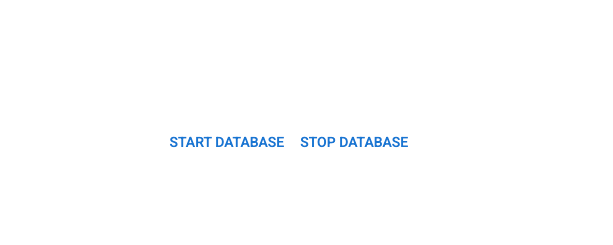

# EmbedJs implementation for Oracle Database

[EmbedJs](https://github.com/llm-tools/embedJs) is a framework to create Retrieval-Augmented Generation (RAG) and Large Language Model (LLM) applications and supports several model and embedding technologies.
[Oracle Database 23ai](https://docs.oracle.com/en/database/oracle/oracle-database/23/) provides inherent support for [storing vectors and performing vector search](https://www.oracle.com/in/database/ai-vector-search/).

This example showcases an EmbedJs implementation of Oracle Database as a vector database, which is similar to [other vector databases supported by EmbedJs](https://llm-tools.mintlify.app/components/vector-databases/overview) and is mostly based on the equivalent [libSQL implementation](https://llm-tools.mintlify.app/components/stores/libsql). The implementation uses [node-oracledb](https://oracle.github.io/node-oracledb/) module for managing database access.

The application is based on [Next.js](https://nextjs.org/) and [MUI](https://github.com/mui/material-ui) and can be used to perform a search based on data loaded from an external URL into the vector database. [Ollama](https://ollama.com/) is used for running in demand models.

The [docker-compose](https://www.npmjs.com/package/docker-compose) module is used to invoke `docker-compose` commands to manage the [Oracle Database 23ai container](https://github.com/oracle/docker-images/blob/main/OracleDatabase/SingleInstance/README.md#running-oracle-database-23ai-free-in-a-container) and the [Ollama container](https://ollama.com/blog/ollama-is-now-available-as-an-official-docker-image).


## Getting started

### Prerequisites

The application requires that you have [podman](https://podman.io/) or [docker](https://www.docker.com/) installed to be able to run [docker-compose](https://github.com/docker/compose).
Also install [Node.js](https://nodejs.org/en) to run the project. `nvm` can be used to install Node.js:

```shell
curl -o- https://raw.githubusercontent.com/nvm-sh/nvm/v0.40.2/install.sh | bash
export NVM_DIR="$HOME/.nvm"
[ -s "$NVM_DIR/nvm.sh" ] && \. "$NVM_DIR/nvm.sh"
nvm install 22.14.0
```

### Create .env.local

Create a  `.env.local` file and specify 
- `config_dir` : Absolute path to the [config](/config/) directory containing `docker-compose.yml`
- `docker_exec` : `docker` or `podman`

```shell
config_dir=/gitprojects/oracledb-embedjs/config
docker_exec=podman
```

### Start the application

```shell
npm run dev
```

Navigate to http://localhost:3000/ and click `START DATABASE` to start the database and Ollama containers.



The screen will show progress messages.

.

Once the services have started, a form will be shown to enter the url of web page for sourcing the data, name of model and the query to be asked.

.

Fill the relevant details and click `EXECUTE SEARCH`. Please note that it might take some time to load a new model if not already pulled in Ollama.


Finally the most relevant result from the web page loaded will be displayed.


### The EmbedJs RAG pipeline

[backend.ts](/src/pages/api/backend.ts) contains the logic for constructing the RAG pipeline, loading the data from external URL and then further executing the query.

```typescript
const store = new OracleStore({ dbConfig: dbConfig })
const vectordb = new OracleDb({ dbConfig, tableName: "vectorTab" })
const app = await new RAGApplicationBuilder()
    .setStore(store)
    .setVectorDatabase(vectordb)
    .setEmbeddingModel(new OllamaEmbeddings({
        model: data.fields.modelName[0],
        baseUrl: 'http://localhost:11434'
    }))
    .setModel(new Ollama({ temperature: 0.0, modelName: data.fields.modelName[0], baseUrl: 'http://localhost:11434' }))
    .build();
await app.addLoader(new WebLoader({ urlOrContent: data.fields.webUrl[0] }));
const response = await app.query(data.fields.query[0]);
```

You can read more about EmbedJs question-answering use case [here](https://llm-tools.mintlify.app/use-cases/question-answering).